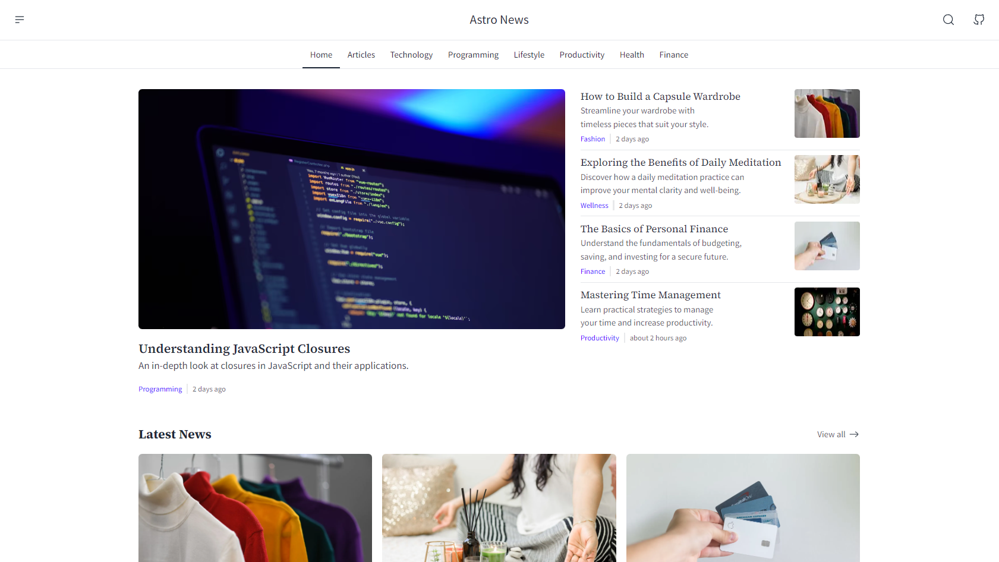

# Things to do in the Hamptons 📰

An events website curated for the hamptons built with Astro, designed to provide a modern and responsive news reading experience.

> **ℹ️ Info**
> Things to do in the Hamptons is my first open-source project, so there may be some bugs or issues. I’ll address them as quickly as possible.



## 🚀 Installation

Follow the steps below to set up and run the project locally:

### Clone the Repository

```bash
git clone https://github.com/Santi1999/things_in_the_hamptons.git
```

### Install Dependencies

```bash
npm install
```

### Run Development Server

```bash
npm run dev
```

## ✨ Features

### Implemented Features

- Content Layer
- Navigation
- Responsive Design
- Pagination
- Search Functionality
- RSS Feed
- Sitemap
- Dark Mode
- SEO Optimization (~)
- Sharing Options

## 💻 Technologies

This project leverages cutting-edge web technologies:

- [Astro V5.0](https://astro.build/) - Modern static site builder
- [Tailwind CSS V4](https://tailwindcss.com/) - Utility-first CSS framework
- [DaisyUI V5](https://daisyui.com/) - Tailwind CSS component library
- [TypeScript](https://www.typescriptlang.org/) - Typed JavaScript
- [MDX](https://mdxjs.com/) - Markdown with JSX support
- [Bun V1.3.8](https://bun.sh/) - Fast JavaScript runtime
- [Vercel](https://vercel.com/) - Deployment platform
- [HugeIcons](https://hugeicons.com/) - Icon library

## 💡 Inspirations and Code Concepts

This project draws inspiration from the following sources:

### Designs

- [BBC News](https://www.bbc.com)
- [NewsHub - News Website](https://dribbble.com/shots/21678041-NewsHub-News-Website)
- [Let'sread - News Landing Page](https://dribbble.com/shots/24675325-Let-sread-News-Landing-Page)

### Events

- [Creating A Pagination Component With Astro](https://rimdev.io/creating-a-pagination-component-with-astro)
- [Adding search to static Astro sites](https://website-thomas-astro.vercel.app/blog/search-static-astro-website)

## 📄 License

Open sourced under the [MIT license](LICENSE).

## 🤝 Contributing

Contributions, issues, and feature requests are welcome! Feel free to check the [issues page](https://github.com/Santi1999/things_in_the_hamptons/issues)
